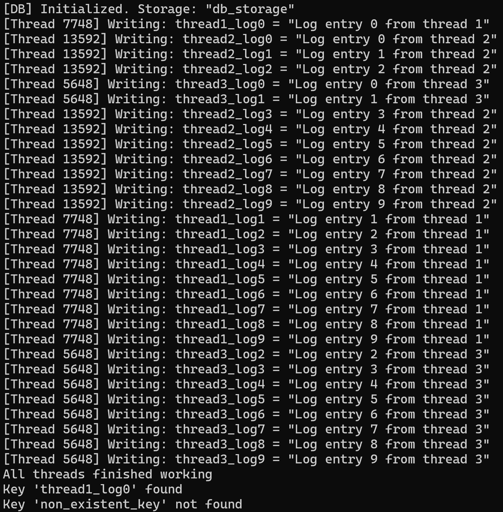

# SafeFileDB

A console utility that simulates a thread-safe key-value file database written in Modern C++20.

## Tech Stack

- C++20
- CMake 3.20+
- STL: `std::filesystem`, `std::mutex`, `std::thread`, `std::optional`, `std::ofstream`

## C++ Concepts Used

- **RAII** — resource management via `std::ofstream` and `std::lock_guard`
- **Templates + Concepts** — `writeNumber<T>` restricted to arithmetic types via `std::is_arithmetic_v<T>`
- **std::optional** — safe return value for read operations without exceptions
- **std::mutex / std::lock_guard** — thread synchronization to prevent data races
- **std::filesystem** — cross-platform directory and file management
- **std::thread** — parallel simulation of 3 concurrent writers

## Build & Run

**Requirements:** CMake 3.20+, C++20 compiler (MSVC / GCC / Clang)

```bash
git clone https://github.com/diiana7/SafeFileDB.git
cd SafeFileDB
cmake -B build
cmake --build build

# Linux / macOS
./build/SafeFileDB

# Windows
./build/Debug/SafeFileDB.exe
```

## Project Structure

```
SafeFileDB/
├── CMakeLists.txt
├── README.md
├── include/
│   └── database.h   
└── src/
    ├── database.cpp     
    └── main.cpp         
```
## Screenshots


